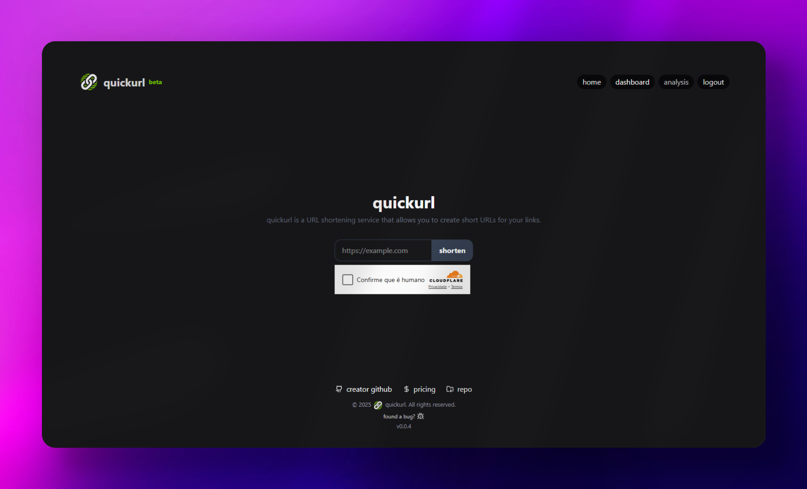

# quickurl



**quickurl** is a simple and fast URL shortener. Easily convert long, unwieldy links into short, shareable URLs for use in chats, emails, or anywhere else.

## Features

- Instantly shorten URLs
- Clean and intuitive interface
- Reliable and fast redirection
- Built with modern web technologies
- Pro plan 
- Manage shortened links
- Customize link slugs
- Manage expiration time for a shortened link
- Define `x` amount of uses for a shortened link
- Data analytics
- 2FA
- QRCode generator for links
- Password protection for links
- Much more...

## Future features
- Public API for url shortening &#128679;

Check changelog at [changelog.md](./changelog.md)

## Tech Stack

- **Next.js** – React framework for server-side rendering and API routes
- **Prisma** – ORM for PostgreSQL database
- **React.js** – Frontend UI
- **Tailwind CSS** – Utility-first CSS framework
- **Zod** – TypeScript-first schema validation
- **React Hook Form** – Form state management
- **Lucide Icons** – Icon library

## Getting Started

1. **Clone the repository:**
    ```bash
    git clone https://github.com/yourusername/quickurl.git
    cd quickurl
    ```

2. **Install dependencies:**
    ```bash
    npm install
    ```

3. **Set up environment variables:**
    - Copy `.env.example` to `.env` and fill in your database credentials.

4. **Run database migrations:**
    ```bash
    npx prisma migrate dev
    ```

5. **Start the development server:**
    ```bash
    npm run dev
    ```

## Contributing

Contributions are welcome! Please open issues or submit pull requests for improvements or bug fixes.

## License

This project is licensed under the MIT License.